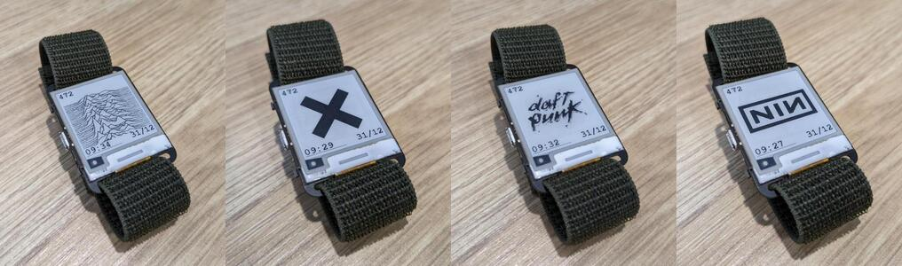

# Show images on your Watchy

Show images on your [Watchy](https://github.com/sqfmi/Watchy).



## Dither Image

1. Find image on web
2. Scale down to 200x200 (Gimp > Image > Scale Image ...)
3. Dither 1-bit (Gimp > Image > Mode > Indexed..., Use black and white 1-bit)
4. Export to bmp (File > Export As > bmp)

## Convert to code

Images converted with https://javl.github.io/image2cpp/

1. Upload image
2. Background colour: White
3. Generate Code
4. Put in images.h
5. Update reference in Watchy_Images.cpp `albums` and `albumCount`

## Build

```
pio run -t upload
```
